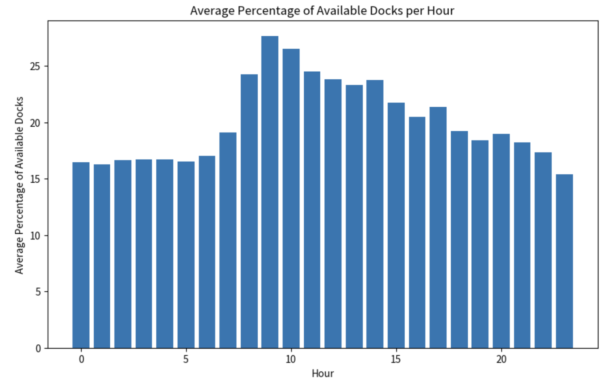

# Time Series Of All Red Hook Citi Bike Docks

## Red Hook Stations

For my analysis I first had to manually create a table of stations located in Red Hook.

| ID                                   | Name                       |
|--------------------------------------|----------------------------|
| 66de1516-0aca-11e7-82f6-3863bb44ef7c | Coffey St & Conover St     |
| 66de11bc-0aca-11e7-82f6-3863bb44ef7c | Wolcott St & Dwight St     |
| 66de4897-0aca-11e7-82f6-3863bb44ef7c | Columbia St & W 9 St       |
| 66de103b-0aca-11e7-82f6-3863bb44ef7c | Dwight St & Van Dyke St    |
| 66de14af-0aca-11e7-82f6-3863bb44ef7c | Van Brunt St & Wolcott St  |
| 66de0cab-0aca-11e7-82f6-3863bb44ef7c | Columbia St & Lorraine St  |
| c01a9c97-6c04-4e3f-ad0b-958801d94ca1 | Bay St & Court St          |
| 40042fb4-6ddd-4f74-bb52-5af3e4e08c8d | Coffey St & Ferris St      |
| 66de47bf-0aca-11e7-82f6-3863bb44ef7c | Commerce St & Van Brunt St |
| 66de18d7-0aca-11e7-82f6-3863bb44ef7c | Sigourney St & Columbia St |
| 66de0a78-0aca-11e7-82f6-3863bb44ef7c | Henry St & Bay St          |
| 66de482a-0aca-11e7-82f6-3863bb44ef7c | Richards St & Delavan St   |
| 633fbc4c-7617-47ba-a393-aad7a8d26a3e | Van Brunt St & Van Dyke St |
| 66de1295-0aca-11e7-82f6-3863bb44ef7c | Pioneer St & Richards St   |
| 66de08c9-0aca-11e7-82f6-3863bb44ef7c | Clinton St & Centre St     |
| 66de1368-0aca-11e7-82f6-3863bb44ef7c | Pioneer St & Van Brunt St  |
| 66de48f9-0aca-11e7-82f6-3863bb44ef7c | Henry St & W 9 St          |
| 66de44ba-0aca-11e7-82f6-3863bb44ef7c | Carroll St & Columbia St   |
| 66de63cd-0aca-11e7-82f6-3863bb44ef7c | Columbia St & Degraw St    |

## Station Info

To take a quick peak at the current state of the Citi Bike docks in Red Hook you can run the following command:

```shell
./bin/dockscan info \
  --id 66de1516-0aca-11e7-82f6-3863bb44ef7c \
  --id 66de11bc-0aca-11e7-82f6-3863bb44ef7c \
  --id 66de4897-0aca-11e7-82f6-3863bb44ef7c \
  --id 66de103b-0aca-11e7-82f6-3863bb44ef7c \
  --id 66de14af-0aca-11e7-82f6-3863bb44ef7c \
  --id 66de0cab-0aca-11e7-82f6-3863bb44ef7c \
  --id c01a9c97-6c04-4e3f-ad0b-958801d94ca1 \
  --id 40042fb4-6ddd-4f74-bb52-5af3e4e08c8d \
  --id 66de47bf-0aca-11e7-82f6-3863bb44ef7c \
  --id 66de18d7-0aca-11e7-82f6-3863bb44ef7c \
  --id 66de0a78-0aca-11e7-82f6-3863bb44ef7c \
  --id 66de482a-0aca-11e7-82f6-3863bb44ef7c \
  --id 633fbc4c-7617-47ba-a393-aad7a8d26a3e \
  --id 66de1295-0aca-11e7-82f6-3863bb44ef7c \
  --id 66de08c9-0aca-11e7-82f6-3863bb44ef7c \
  --id 66de1368-0aca-11e7-82f6-3863bb44ef7c \
  --id 66de48f9-0aca-11e7-82f6-3863bb44ef7c \
  --id 66de44ba-0aca-11e7-82f6-3863bb44ef7c \
  --id 66de63cd-0aca-11e7-82f6-3863bb44ef7c | jq .
```

## Time Series Data

In order to create CSVs with time series data you can run:

```shell
./bin/dockscan ts \
  --exclude Longitude,Latitude,Location,ID \
  --interval 300 \
  --id 66de1516-0aca-11e7-82f6-3863bb44ef7c \
  --id 66de11bc-0aca-11e7-82f6-3863bb44ef7c \
  --id 66de4897-0aca-11e7-82f6-3863bb44ef7c \
  --id 66de103b-0aca-11e7-82f6-3863bb44ef7c \
  --id 66de14af-0aca-11e7-82f6-3863bb44ef7c \
  --id 66de0cab-0aca-11e7-82f6-3863bb44ef7c \
  --id c01a9c97-6c04-4e3f-ad0b-958801d94ca1 \
  --id 40042fb4-6ddd-4f74-bb52-5af3e4e08c8d \
  --id 66de47bf-0aca-11e7-82f6-3863bb44ef7c \
  --id 66de18d7-0aca-11e7-82f6-3863bb44ef7c \
  --id 66de0a78-0aca-11e7-82f6-3863bb44ef7c \
  --id 66de482a-0aca-11e7-82f6-3863bb44ef7c \
  --id 633fbc4c-7617-47ba-a393-aad7a8d26a3e \
  --id 66de1295-0aca-11e7-82f6-3863bb44ef7c \
  --id 66de08c9-0aca-11e7-82f6-3863bb44ef7c \
  --id 66de1368-0aca-11e7-82f6-3863bb44ef7c \
  --id 66de48f9-0aca-11e7-82f6-3863bb44ef7c \
  --id 66de44ba-0aca-11e7-82f6-3863bb44ef7c \
  --id 66de63cd-0aca-11e7-82f6-3863bb44ef7c \
  --csv \
  --output ~/Documents/citibike/
```

Break down of the command:

- `./bin/dockscan ts`: This initiates the time series data collection command of `dockscan`.
- `--exclude Longitude,Latitude,Location,ID`: This excludes the specified columns from the output CSV file.
- `--interval 300`: This fetches data every 300 seconds (or 5 minutes).
- `--id 581211b2-4e42-48f2-8a8f-5f968cb1c5df`: This specifies the ID of the station you are interested in. Replace it
  with the ID of the station in Red Hook you are tracking.
- `--csv`: This specifies that the output should be in CSV format.
- `--output-dir ~/Documents/citibike/`: This specifies the directory where the output CSV file will be stored, which in
  this case is the `citibike` folder inside the `Documents` directory. You can modify this path as per your needs.

## Plot a graph

I recommend opening [this notebook file](red_hook_ts.ipynb) with Jupyter Notebook. This file contains a collection of
example charts.

However, you can also make a chart with raw python as follows:

[You can grab a CSV with data from July 25th 2023 here](2023-07-25.csv). For a graph with the average percentage of
available docks you can use:

```
import pandas as pd
import matplotlib.pyplot as plt

# Load the data
data = pd.read_csv('2023-07-25.csv')

# Convert the 'TimeStamp' column to a datetime data type
data['TimeStamp'] = pd.to_datetime(data['TimeStamp'])

# Extract the hour from the 'TimeStamp' column
data['Hour'] = data['TimeStamp'].dt.hour

# Calculate the total capacity for each timestamp
data['TotalCapacity'] = data['BikesDisabled'] + data['EBikesAvailable'] + data['BikesAvailable'] + data['DocksDisabled'] + data['DocksAvailable']

# Calculate the percentage of available docks for each timestamp
data['PercentageAvailable'] = (data['DocksAvailable'] / data['TotalCapacity']) * 100

# Group by the 'Hour' column and calculate the average percentage of available docks
grouped_data = data.groupby('Hour')['PercentageAvailable'].mean()

# Create a bar chart
plt.figure(figsize=(10, 6))
plt.bar(grouped_data.index, grouped_data.values)
plt.xlabel('Hour')
plt.ylabel('Average Percentage of Available Docks')
plt.title('Average Percentage of Available Docks per Hour')
plt.show()
```

### Expected Output

<p align="center">
  
</p>

### Fun Visualization
Here's a fun map you can make with this data: https://www.batchgeo.com/map/b61973906c476582e65f6a6ec6947214

Used this CSV to produce it:
```text
Location,Label,Category
Clinton St & Centre St Brooklyn NY 11231,Avg Available Docks: 0.329749,Less than 2
Dwight St & Van Dyke St Brooklyn NY 11231,Avg Available Docks: 1.010753,Less than 2
Wolcott St & Dwight St Brooklyn NY 11231,Avg Available Docks: 1.354839,Less than 2
Henry St & W 9 St Brooklyn NY 11231,Avg Available Docks: 1.401434,Less than 2
Sigourney St & Columbia St Brooklyn NY 11231,Avg Available Docks: 1.448029,Less than 2
Columbia St & W 9 St Brooklyn NY 11231,Avg Available Docks: 2.372760,2 to 7
Carroll St & Columbia St Brooklyn NY 11231,Avg Available Docks: 2.526882,2 to 7
Columbia St & Degraw St Brooklyn NY 11231,Avg Available Docks: 2.806452,2 to 7
Pioneer St & Van Brunt St Brooklyn NY 11231,Avg Available Docks: 3.060932,2 to 7
Henry St & Bay St Brooklyn NY 11231,Avg Available Docks: 3.222222,2 to 7
Bay St & Court St Brooklyn NY 11231,Avg Available Docks: 3.487455,2 to 7
Commerce St & Van Brunt St Brooklyn NY 11231,Avg Available Docks: 3.673835,2 to 7
Van Brunt St & Wolcott St Brooklyn NY 11231,Avg Available Docks: 4.408602,2 to 7
Van Brunt St & Van Dyke St Brooklyn NY 11231,Avg Available Docks: 4.770609,2 to 7
Coffey St & Conover St Brooklyn NY 11231,Avg Available Docks: 7.526882,More than 7
Richards St & Delavan St Brooklyn NY 11231,Avg Available Docks: 8.028674,More than 7
Pioneer St & Richards St Brooklyn NY 11231,Avg Available Docks: 12.028674,More than 7
Coffey St & Ferris St Brooklyn NY 11231,Avg Available Docks: 16.175627,More than 7
Columbia St & Lorraine St Brooklyn NY 11231,Avg Available Docks: 19.028674,More than 7
```